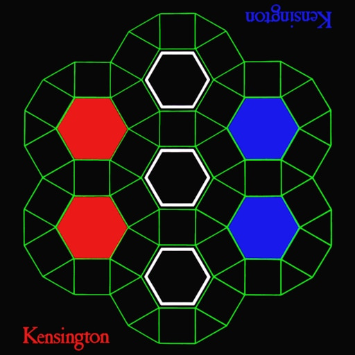

# KENSINGTON

Kensington is a board game developed in the 1970's by Brian Taylor and Peter Forbes.
It is played on a geometrical board inspired by the rhombitrihexagonal mosaic included in the Kensington gardens in London.



## Objective

The first player to take control of all six points of a white hexagon or a hexagon of their own color is the winner.

## Rules

Setup: 

Players alternate placing their counters (game pieces) on any unoccupied intersection of the board. Continue until each player has placed 15 counters.

Movement: 

Once all counters are placed, players may move their counters along lines to adjacent unoccupied intersections.

Mills:

-Single Mill: Take control of all three vertices of any triangle with your counters and you can move one opponent's counter to any vacant vertex.

-Double Mill: Take control of all four vertices of any square with your counters and you can move two opponent's counter's to any vacant vertex.

## Command Line Gameplay


I have plans to update this project to include a GUI. At the moment it is playable through the command line with a coordinate map.

The coordinate map is included at the top of this README instead of clicking and moving a game piece you will input the numbers that correspond to the space on the board you are referencing.

## Makefile Info

In terminal run

```bash
make
```

and then

```bash
./main
```
