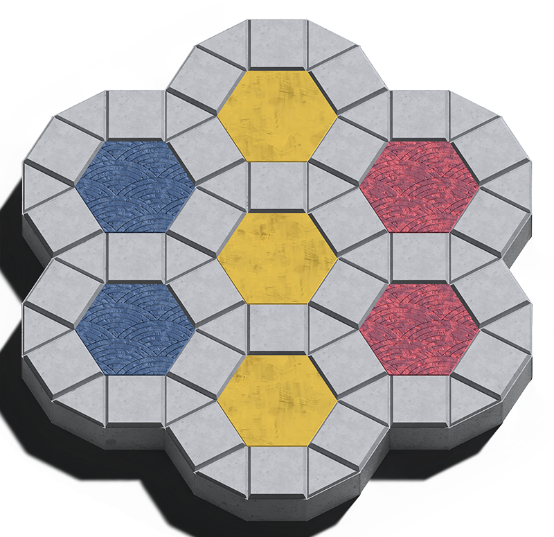

# KENSINGTON

Kensington is a board game developed in the 1970's by Brian Taylor and Peter Forbes.
It is played on a geometrical board inspired by the rhombitrihexagonal mosaic included in the Kensington gardens in London.

The simplicity of the game rules are what lead to the abstract and complex strategy employed by players.



## Objective

The first player to take control of all six points of a white hexagon or a hexagon of their own color is the winner.

## Rules

Setup: 

Players alternate placing their counters (game pieces) on any unoccupied intersection of the board. Continue until each player has placed 15 counters.

Movement: 

Once all counters are placed, players may move their counters along lines to adjacent unoccupied intersections.

Mills:

-Single Mill: Take control of all three vertices of any triangle with your counters and you can move one opponent's counter to any vacant vertex.

-Double Mill: Take control of all four vertices of any square with your counters and you can move two opponent's counter's to any vacant vertex.

## Makefile Info
In terminal run

```bash
make
```

and then

```bash
./main
```

## Contributing

Pull requests are welcome. For major changes, please open an issue first
to discuss what you would like to change.

## License

[MIT](https://choosealicense.com/licenses/mit/)